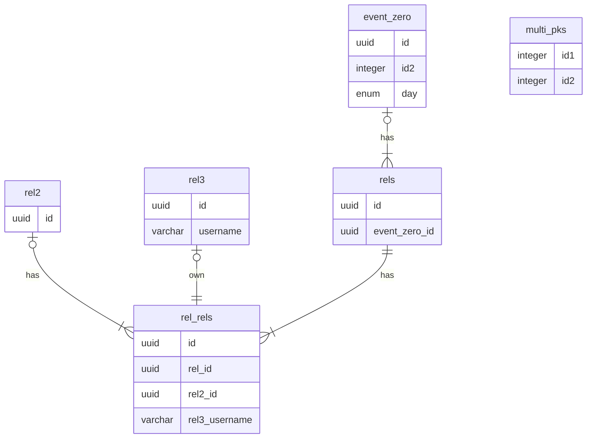

```mermaid
erDiagram

rel2 |o--|{ rel_rels : has 
rel3 |o--|| rel_rels : own
rels ||--|{ rel_rels : has 
event_zero |o--|{ rels : has 


event_zero {
  uuid id
  integer id2
  enum day
}

multi_pks {
  integer id1
  integer id2
}

rel2 {
  uuid id
}

rel3 {
  uuid id
  varchar username
}

rel_rels {
  uuid id
  uuid rel_id
  uuid rel2_id
  varchar rel3_username
}

rels {
  uuid id
  uuid event_zero_id
}


```